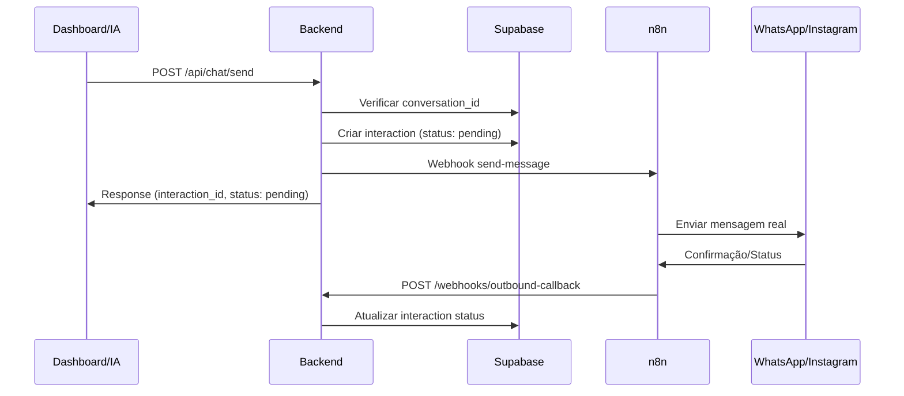

# Sprint 7 - Envio de Mensagens (Backend → n8n → Canais)

## 📋 Resumo da Implementação

A Sprint 7 foi **concluída com sucesso** e implementa o sistema completo de envio de mensagens do backend para os canais via n8n, permitindo respostas tanto pelo dashboard quanto pelo futuro Agente IA.

## 🚀 Funcionalidades Implementadas

### 1. Endpoint de Envio (`POST /api/chat/send`)
- **Rota:** `/api/chat/send`
- **Autenticação:** Requer autenticação + tenant scope
- **Payload:**
```json
{
  "conversation_id": 123,
  "message": "Texto da mensagem",
  "channel": "whatsapp|instagram", // opcional - inferido automaticamente
  "type": "general|appointment_reminder|marketing|follow_up|promotion|birthday" // opcional
}
```

### 2. Sistema de Registro de Interactions Outbound
- Mensagens são registradas em `interactions` com `direction=outbound`
- Status inicial: `pending` → atualizado via callback
- Armazena timestamps específicos (`delivered_at`, `read_at`)
- Metadados adicionais em campo JSONB

### 3. Comunicação com n8n
- Service dedicado (`OutboundMessageService`)
- Integração com sistema multi-tenant de credenciais
- Payload padronizado para n8n:
```json
{
  "company_id": "uuid-da-clinica",
  "channel": "whatsapp",
  "client_contact": "+5511999999999",
  "message": "Texto da mensagem",
  "interaction_id": 123,
  "timestamp": "2024-01-01T12:00:00Z",
  "metadata": {
    "api_key": "credencial-da-empresa"
  }
}
```

### 4. Sistema de Callback
- **Rota:** `/webhooks/outbound-callback`
- **Autenticação:** HMAC ou token compartilhado
- **Payload:**
```json
{
  "interaction_id": 123,
  "company_id": "uuid-da-clinica",
  "status": "sent|delivered|read|failed",
  "error_message": "...", // opcional para failed
  "delivered_at": "2024-01-01T12:00:00Z", // opcional
  "read_at": "2024-01-01T12:00:00Z", // opcional
  "external_message_id": "whatsapp-msg-id" // opcional
}
```

## 🔧 Configuração Necessária

### Variáveis de Ambiente
```bash
# URL do webhook n8n para envio
N8N_OUTBOUND_WEBHOOK_URL=http://localhost:5678/webhook/send-message

# Autenticação opcional com n8n
N8N_AUTH_TOKEN=seu-token-aqui
N8N_WEBHOOK_SECRET=seu-secret-aqui

# Secret para callbacks (usado pelo n8n)
N8N_OUTBOUND_CALLBACK_SECRET=secret-compartilhado-seguro
```

### Configuração do n8n
O n8n deve ser configurado para:
1. **Receber mensagens** do backend no endpoint `/webhook/send-message`
2. **Enviar para os canais** (WhatsApp, Instagram) usando as credenciais da empresa
3. **Reportar status** via callback para `/webhooks/outbound-callback`

## 📊 Migração do Banco de Dados

### Enum Atualizado
```sql
-- Adicionado 'pending' ao enum interaction_status
ALTER TYPE interaction_status ADD VALUE 'pending';
```

### Campos Adicionados
```sql
-- Novos campos na tabela interactions
ALTER TABLE interactions 
ADD COLUMN delivered_at TIMESTAMP,
ADD COLUMN read_at TIMESTAMP,
ADD COLUMN metadata JSONB DEFAULT '{}';
```

## 🧪 Testes Implementados

### Testes Unitários
- **ChatController:** Validação de envio, tratamento de erros, schemas
- **OutboundMessageService:** Comunicação com n8n, credenciais, payloads

### Cenários Cobertos
- ✅ Envio de mensagem com sucesso
- ✅ Validação de payload inválido
- ✅ Conversa não encontrada
- ✅ Conversa fechada (erro)
- ✅ Integração com credenciais multi-tenant
- ✅ Callback de status de entrega
- ✅ Tratamento de erros do n8n

## 🔒 Segurança

### Multi-Tenant
- Todas as operações respeitam `company_id`
- Credenciais isoladas por empresa via tabela `integrations`
- Políticas RLS aplicadas

### Autenticação
- **Endpoints API:** JWT + tenant scope
- **Callbacks:** HMAC sha256 ou token compartilhado
- **n8n:** Token Bearer opcional

## 📋 Fluxo Completo



## 🎯 Definição de Pronto Atingida

✅ **Envio via API** cria `interaction` outbound e dispara n8n  
✅ **Respostas de status** são refletidas via callback  
✅ **Integração multi-tenant** funcional  
✅ **Testes** cobrindo cenários principais  
✅ **Documentação** completa  

## 🔄 Próximos Passos

A Sprint 8 poderá focar na geração de snapshots de contexto para o Agente Analista, conforme definido no `StepByStep.md`.

---

**✅ Sprint 7 Concluída - Sistema de Envio de Mensagens Implementado!**
